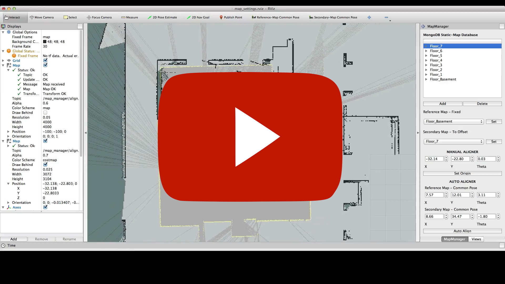

Multi-Map Navigation
====================

<p align="middle">
    <a href="http://www.youtube.com/watch?feature=player_embedded&v=2hI9hNIvbrc
    " target="_blank"></a>
</p>

multi_map_navigation allows you to break up large static-maps into smaller, more managable chunks, and interconnect them through a series of 'wormholes'. This allows you to isolate areas behind closed doors, or experiment with autonomous navigation across multiple floors with premeditated map-transitions.

This package is a catkinized version of an [old stack](http://wiki.ros.org/multi_map_navigation) with additional functionality and GUI controls.

## Dependencies & Prerequisites

**Core**: [ROS Hydro](http://wiki.ros.org/hydro), [Catkin](http://wiki.ros.org/catkin): [actionlib](http://wiki.ros.org/actionlib), [warehouse_ros](http://wiki.ros.org/warehouse_ros), [rviz](http://wiki.ros.org/rviz), [map_server](http://wiki.ros.org/map_server) (see [package.xml](package.xml))

**Additional**: (Custom Requirements): [map_store](https://github.com/MohitShridhar/map_store), [namespace_mux](https://github.com/MohitShridhar/namespace_mux)

**Others**: [Qt4](http://qt-project.org/) (or higher), [MongoDB](http://docs.mongodb.org/manual/installation/) 2.6

## Installation
Clone package & custom dependencies:
```bash
$ cd <catkin_ws>/src
$ git clone https://github.com/MohitShridhar/multi_map_navigation.git
$ git clone https://github.com/MohitShridhar/namespace_mux.git
$ git clone https://github.com/MohitShridhar/map_store.git
```

Resolve other dependencies (in Ubuntu):
```bash
$ cd <catkin_ws>
$ rosdep install --from-paths src --ignore-src --rosdistro hydro -y
```

Compile:
```bash
$ cd <catkin_ws>
$ catkin_make --pkg map_store namespace_mux multi_map_navigation
```

Check that the messages & services were properly generated:
```bash
$ rosmsg list
...
multi_map_navigation/MultiMapNavigationAction
multi_map_navigation/MultiMapNavigationActionFeedback
multi_map_navigation/MultiMapNavigationActionGoal
multi_map_navigation/MultiMapNavigationActionResult
multi_map_navigation/MultiMapNavigationFeedback
multi_map_navigation/MultiMapNavigationGoal
multi_map_navigation/MultiMapNavigationResult
multi_map_navigation/MultiMapNavigationTransitionAction
multi_map_navigation/MultiMapNavigationTransitionActionFeedback
multi_map_navigation/MultiMapNavigationTransitionActionGoal
multi_map_navigation/MultiMapNavigationTransitionActionResult
multi_map_navigation/MultiMapNavigationTransitionFeedback
multi_map_navigation/MultiMapNavigationTransitionGoal
multi_map_navigation/MultiMapNavigationTransitionResult
...
$ rossrv list
...
multi_map_navigation/ReinitManager
multi_map_navigation/SetMap
...
```

## Usage

### Launch file

Once you have setup the [config file](https://github.com/MohitShridhar/multi_map_navigation/wiki/1.-Setup#configuration), spawn the 'multi_map_navigation' node in your launch file to manage navigation & map-transitions:
```xml
<group ns="robot0">
...
    <node pkg="multi_map_navigation" type="multi_map_navigation_manager.py" name="multi_map_navigation" output="screen">
      <param name="definition_file" value="$(find <navigation_stack>)/config/<config>.yaml" />
      <param name="transition_types" value="elevator_blast" />

      <param name="robot_namespace" value="robot0"/>
      <param name="base_frame" value="base_link"/>
    </node>
...
</group>
```
The `robot_namespace` parameter is redundant. See [issue #1](/../../issues/1)
### Guide:

See the [wiki](https://github.com/MohitShridhar/multi_map_navigation/wiki/0.-User-Guide) for more details on setup & usage.


#..
